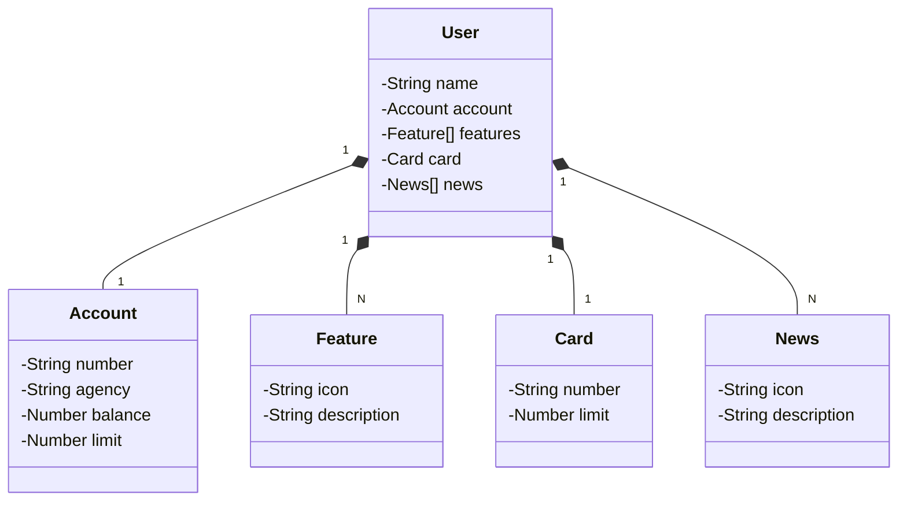

# ClienteEnderecoAPI


## Descrição do Projeto
Este projeto é uma API REST desenvolvida em Java com Spring Boot para o cadastro de clientes. A aplicação consome a API pública do [ViaCep](https://viacep.com.br) para preencher automaticamente os dados de endereço dos clientes com base no CEP informado garantindo sua persistência. A API oferece endpoints para criar, atualizar, buscar e remover clientes, garantindo que as informações de endereço sejam consistentes e completas. Extra: simulação de trabalho coletivo usando comandos git ao executar criação, uso e merge de branches, com lançamentos e aprovação de PRs.

## Funcionalidades
- Cadastro de usuários (clientes do banco)
- Busca de usuarios pelo número do id

## Principais Tecnologias
- **Java 17**: Versão LTS mais recente do Java para tirar vantagem das últimas inovações que essa linguagem robusta e amplamente utilizada oferece;
- **Spring Boot 3**: Maximiza a produtividade do desenvolvedor por meio de sua poderosa premissa de autoconfiguração;
- **Spring Data JPA**: Simplificação da camada de acesso aos dados, facilitando a integração com bancos de dados SQL;
- **OpenAPI (Swagger)**: Documentação de API eficaz e fácil de entender usando a OpenAPI (Swagger), perfeitamente alinhada com a alta produtividade que o Spring Boot oferece;
- **Railway**: facilita o deploy e monitoramento das soluções na nuvem, além de oferecer diversos bancos de dados como serviço e pipelines de CI/CD.

## Arquitetura do Projeto
O projeto segue a estrutura MVC (Model-View-Controller) e está organizado da seguinte forma:

```
src/
 └── main/
     └── java/
         └── com.clienteEnderecoAPI/
                ├── controller/  # Controladores REST
                ├── model/       # Entidades Cliente e Endereço
                ├── service/     # Lógica de negócios e integração ViaCep
                └── repository/  # Repositórios JPA
             
```
## Diagrama de Classes (Domínio da API)

